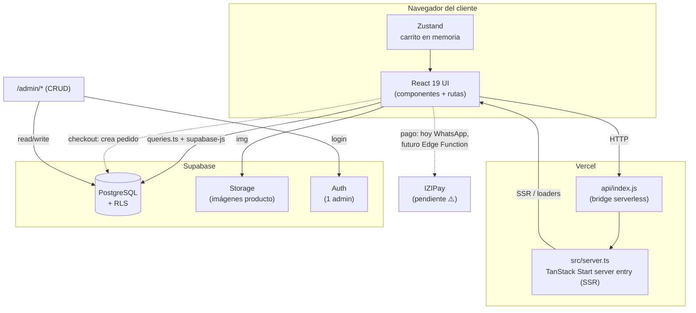
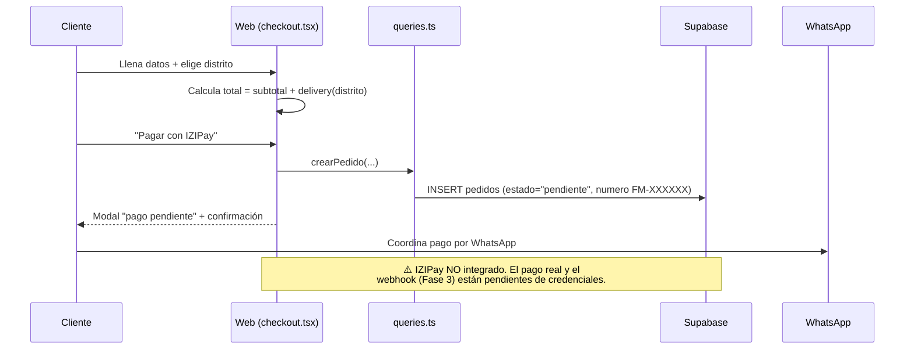

# Arquitectura — Florería Miraflores

Documento técnico del sistema. Describe **lo que el código realmente implementa hoy** (verificado sobre `src/`), no la propuesta original. Donde el código difiere del `CLAUDE.md`, se marca ⚠️.

Última revisión: 2026-09-24

---

## 1. Resumen

E-commerce de flores para Lima (Miraflores, Surco, Barranco, Lince, San Isidro) con catálogo dinámico, carrito, checkout con delivery por distritos y panel de administración. Frontend en React 19 sobre **TanStack Start** (con render en servidor), datos en **Supabase**, desplegado en **Vercel**.

> ⚠️ **Divergencia de stack.** El `CLAUDE.md` (sección 3) dice *"Sin SSR. Todo SPA con Vite"* y *"React Router v6"*. El código real usa **TanStack Start + TanStack Router** con un entry de servidor (`src/server.ts`) y un bridge serverless (`api/index.js`). Es SSR-capable, no un SPA puro.

---

## 2. Stack real (verificado en `package.json`)

| Capa | Tecnología |
| --- | --- |
| UI | React 19 + Tailwind CSS v4 |
| Framework / Router | TanStack Start + TanStack Router (file-based en `src/routes/`) |
| Data fetching | TanStack React Query + funciones en `src/lib/queries.ts` |
| Formularios | React Hook Form + Zod (validación) |
| Estado global | Zustand (`src/store/cart.ts`) — solo carrito, en memoria |
| Backend / DB | Supabase (PostgreSQL 17, Storage, Auth, RLS) |
| Build | Vite 7 |
| Deploy | Vercel (bridge `api/index.js` → `dist/server/server.js`) |
| Pasarela | IZIPay — ⚠️ aún NO integrada (flujo manual/WhatsApp) |

---

## 3. Diagrama de arquitectura



---

## 4. Estructura de carpetas (`src/`)

```
src/
├── routes/                 Rutas (file-based, TanStack Router)
│   ├── index.tsx           Home
│   ├── catalogo.tsx        Catálogo completo (con filtros)
│   ├── categoria.$slug.tsx / .$sub.tsx   Categoría y subcategoría
│   ├── producto.$id.tsx    Ficha de producto
│   ├── tag.$key.tsx        Listado por tag (novedad, oferta, etc.)
│   ├── checkout.tsx        Checkout + delivery por distrito
│   ├── confirmacion.tsx    Confirmación de pedido
│   ├── libro-de-reclamaciones.tsx
│   ├── admin-login.tsx / admin.tsx
│   └── admin/              Panel: banners, popup, categorias, productos,
│                           colecciones-home, ocasiones, distritos, pedidos,
│                           reclamaciones, tags, config, dashboard
├── components/             UI (Header, Hero, ProductGrid, CartDrawer,
│                           ProductFilters, PopupModal, Footer, …) + ui/ (46 shadcn)
├── lib/
│   ├── supabase.ts         Cliente Supabase (VITE_SUPABASE_URL / ANON_KEY)
│   ├── queries.ts          Todas las consultas a la BD
│   ├── image-optimizer.ts  Optimización de imágenes
│   └── utils.ts, error-capture.ts, error-page.ts
├── store/cart.ts           Estado del carrito (Zustand)
├── types/database.ts       Tipos de las tablas
├── server.ts / start.ts    Entradas SSR y cliente de TanStack Start
└── styles.css              Tokens de diseño (color, tipografía) — ver /brand
```

---

## 5. Capas y responsabilidades

**Presentación** — Componentes en `src/components/` + rutas en `src/routes/`. Sin lógica de negocio; consumen datos vía loaders y `queries.ts`.

**Acceso a datos** — `src/lib/queries.ts` centraliza toda lectura/escritura a Supabase con `supabase-js`. Ningún componente habla con la BD directamente salvo por estas funciones. `src/lib/supabase.ts` crea el cliente con la anon key (segura para frontend por RLS).

**Estado** — Zustand (`store/cart.ts`) mantiene el carrito solo en memoria del navegador; nunca se persiste en BD (por diseño).

**Servidor** — `server.ts` es el entry SSR de TanStack Start. En Vercel, `api/index.js` traduce la request Node ↔ Web `Request/Response` y la pasa al server compilado (`dist/server/server.js`).

---

## 6. Modelo de datos (Supabase)

```mermaid
erDiagram
    categorias ||--o{ categorias : "parent_id (auto-ref)"
    categorias ||--o{ productos : "categoria_id"
    categorias ||--o{ ocasiones_home : "categoria_id"
    categorias ||--o{ colecciones_home : "categoria_id"
    distritos  ||--o{ pedidos : "distrito_id"

    config { uuid id }
    banners { uuid id, int orden, bool activo }
    popup { uuid id, bool activo }
    categorias { uuid id, text slug, uuid parent_id }
    productos { uuid id, numeric precio, text[] imagenes, text[] tags }
    ocasiones_home { uuid id }
    colecciones_home { uuid id }
    distritos { uuid id, numeric precio_delivery }
    pedidos { uuid id, text numero, jsonb productos, text estado }
```

Tablas: `config`, `banners`, `popup`, `categorias`, `productos`, `ocasiones_home`, `colecciones_home`, `distritos`, `pedidos`. Detalle de columnas, RLS y seed en `BASE-DE-DATOS.md` y `CLAUDE.md` (sección 11).

**RLS:** lectura pública en catálogo/config; escritura solo admin; `pedidos` permite INSERT público (checkout) y SELECT/UPDATE solo admin.

---

## 7. Flujo de checkout (estado actual)



**Flujo objetivo (Fase 3, aún no construido):** el checkout llamaría una Edge Function que crea el pedido, pide token a IZIPay, redirige al cliente al entorno seguro, y un webhook actualiza el pedido a "pagado" + notifica. Ver `CLAUDE.md` sección 10.

---

## 8. Estado de implementación (verificado)

| Área | Estado |
| --- | --- |
| Home, catálogo, categorías, producto, tags | ✅ |
| Filtros de precio + ordenamiento (`ProductFilters`) | ✅ (usado en catálogo, categorías y tags) |
| Carrito (Zustand + CartDrawer) | ✅ |
| Checkout con delivery por distrito | ✅ |
| Confirmación de pedido | ✅ |
| Panel admin completo (CRUD) | ✅ |
| Supabase + RLS + Storage | ✅ |
| **Pasarela IZIPay** | ⚠️ Pendiente (flujo manual por WhatsApp) |
| **Notificación por correo al recibir pedido** | ❌ No implementada |
| **Estado "En preparación"** del pedido | ❌ Falta (hay: pendiente, pagado, en_camino, entregado, cancelado) |
| Logo vectorial (SVG) | ✅ Añadido en `brand/logo/` |

---

## 9. Variables de entorno

```
# Frontend (pueden ir al cliente — protegido por RLS)
VITE_SUPABASE_URL=
VITE_SUPABASE_ANON_KEY=

# Solo servidor / Edge Functions (NUNCA en frontend) — Fase 3
IZIPAY_PUBLIC_KEY=  IZIPAY_PASSWORD=  IZIPAY_SHA_KEY=  IZIPAY_MERCHANT_ID=  IZIPAY_BASE_URL=
```

---

## 10. Deuda técnica / pendientes

1. **IZIPay** — integrar vía Edge Function + webhook (bloqueado por credenciales de Sofía).
2. **Correo transaccional** — no existe ningún servicio de email; la cotización lo promete.
3. **Estado "En preparación"** — añadir al enum de pedidos para cumplir los 4 estados de la cotización.
4. **Alinear identidad visual** — `CLAUDE.md` (champagne + Cormorant) vs. código real (rosa + DM Sans). Ver `brand/README.md`.
5. **Alinear el `CLAUDE.md`** — actualizar la sección 3 para reflejar TanStack Start (no SPA/React Router).
